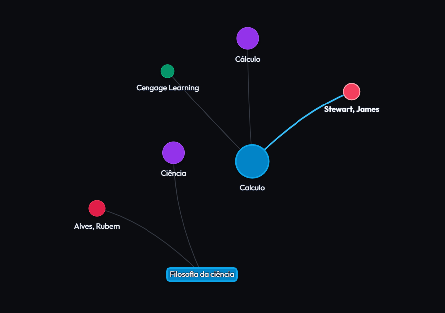

# Pergamum Graph Explorer (BU UFSC)



Um explorador visual e interativo de conexões para o acervo da Biblioteca Universitária da Universidade Federal de Santa Catarina (BU / UFSC). Esta ferramenta permite carregar dados bibliográficos e navegar pelas relações de **autores**, **assuntos** e **editoras** por meio de um grafo de rede dinâmico.

---

## 🚀 Como funciona

1. **Adição por código**: insira um código de acervo (ex: `267587` para Cálculo, ou `356805` para *Deep Work*) para desenhar o nó da obra no grafo.
2. **Conexões automáticas**: o sistema lê os campos MARC21 da obra e cria conexões visuais com seus:
   - **Autores** (nós rosa/coral, extraídos dos campos MARC `100` e `700`)
   - **Assuntos** (nós roxos, extraídos do campo MARC `650`)
   - **Editora** (nós verdes, extraídos do campo MARC `260`)
3. **Fusão de grafos**: se você ativar a opção "Mesclar no grafo da sessão", novas obras adicionadas que compartilhem autores, assuntos ou editoras se conectarão automaticamente aos nós existentes.
4. **Navegação lateral**: ao clicar ou dar duplo clique em um nó de assunto ou autor, o painel lateral permite buscar novas obras relacionadas diretamente na base real da BU/UFSC e adicioná-las ao grafo com um clique em `＋`.

---

## 🔍 Comportamento da busca por assuntos (campos MARC21)

> [!IMPORTANT]  
> A busca por conexões de **Assunto** utiliza a API geral do Pergamum. É importante destacar que a consulta por um termo de assunto pode retornar registros onde esse termo aparece indexado em **diversos campos MARC21** (como no título `245`, notas gerais `5XX` ou resumo), e não exclusivamente no campo dedicado a assunto (`650`). 
>
> Esse comportamento é nativo do motor de busca do Pergamum UFSC e foi mantido no explorador de grafos pois enriquece a descoberta de materiais correlatos que abordam o tema, mesmo que a catalogação principal do livro utilize tags de assunto ligeiramente diferentes.

---

## 🛠️ Tecnologias utilizadas

- **Frontend**: HTML5, CSS3 (com design Dark Glassmorphism moderno e responsivo) e JavaScript (vanilla).
- **Visualização de rede**: [Vis-Network](https://visjs.github.io/vis-network/docs/network/) para renderização dinâmica e física interativa das conexões.
- **Backend**: Node.js (usando um servidor HTTP simples em `server.js` para servir os arquivos e atuar como proxy para a API da UFSC).

---

## 💻 Como executar localmente

1. Certifique-se de ter o Node.js instalado no sistema.
2. Abra um terminal na pasta do projeto e inicie o servidor:
   ```bash
   node server.js
   ```
   ou
   ```bash
   python server.py
   ```
3. Acesse no seu navegador: [http://localhost:3000](http://localhost:3000)

## 🐳 Como executar com Docker

1. Construa a imagem Docker a partir da pasta do projeto:
   ```bash
   docker build -t pergamum-graph-explorer:latest .
   ```
2. Inicie o container:
   ```bash
   docker run --rm -p 3000:3000 pergamum-graph-explorer:latest
   ```
3. Acesse no navegador: [http://localhost:3000](http://localhost:3000)

> A imagem usa `node:alpine` e executa o servidor com `node server.js`, com execução por um usuário não-root para melhorar a segurança.

---

## 📝 Licença

Este projeto é de uso livre para fins educacionais e de pesquisa bibliográfica.
