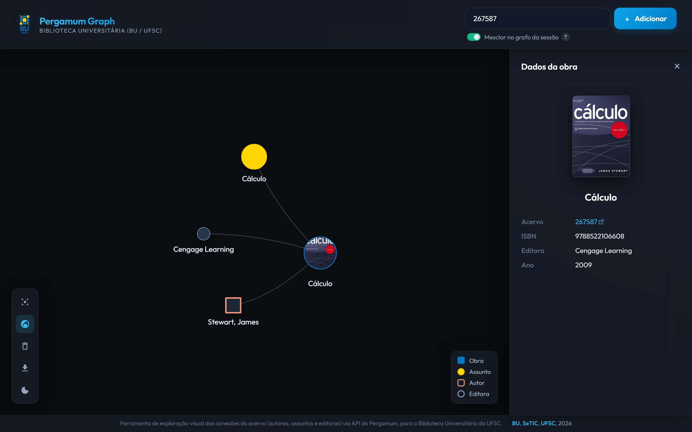
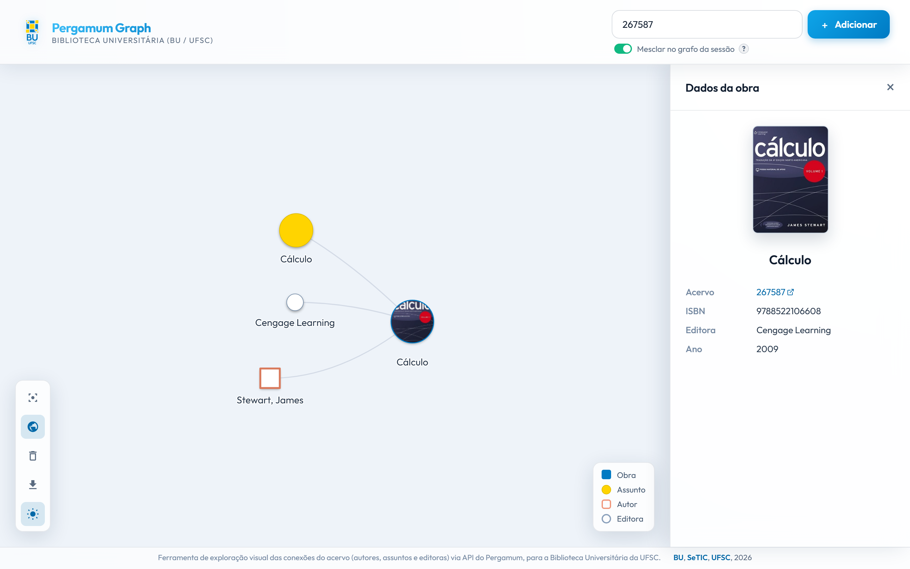

# Pergamum Graph Explorer (BU / UFSC)



Um explorador visual e interativo de conexões para o acervo da Biblioteca Universitária da Universidade Federal de Santa Catarina (BU / UFSC). Esta ferramenta permite carregar dados bibliográficos e navegar pelas relações de **autores**, **assuntos** e **editoras** por meio de um grafo de rede dinâmico.

---

## 🚀 Como funciona

1. **Adição por código**: insira um código de acervo (ex: `267587` para *Cálculo*) e clique em **Adicionar** para desenhar o nó da obra no grafo.
2. **Conexões automáticas**: o sistema lê os campos MARC21 da obra e cria conexões visuais, diferenciadas por **cor e forma**:
   - 🟦 **Obra** — quadrado azul (ou a capa, quando disponível) — MARC `245`
   - 🟨 **Assunto** — círculo amarelo (os *hubs* de conexão) — MARC `650`
   - ⬜ **Autor** — quadrado contornado coral — MARC `100` e `700`
   - ⚪ **Editora** — círculo neutro — MARC `260`

   Uma **legenda** fixa no canto do grafo resume essa codificação.
3. **Fusão de grafos**: com a opção "Mesclar no grafo da sessão" ativa, novas obras que compartilhem autores, assuntos ou editoras se conectam automaticamente aos nós já existentes, revelando a teia de relações do acervo.
4. **Busca lateral na BU**: ao clicar (ou dar duplo clique) em um nó de assunto ou autor, o painel lateral permite buscar novas obras relacionadas diretamente na base real da BU/UFSC e adicioná-las ao grafo com um clique em `＋` (ou deixar o botão "Escolha para mim" sortear uma).
5. **Remoção de acervo**: uma obra pode ser removida pelo botão **Remover do grafo** no painel, ou por **clique‑direito** no nó. Ao remover, autores/assuntos/editoras que ficarem sem conexão são limpos automaticamente; conectores ligados a outras obras permanecem.
6. **Link direto**: cada obra tem uma URL própria no formato `/acervo/:id` (ex: `http://localhost:3000/acervo/267587`), compartilhável e com suporte aos botões Voltar/Avançar do navegador.

---

## 🎨 Identidade visual e temas

A interface segue o **Manual de Identidade Visual da BU/UFSC** (jul/2020), com a paleta institucional oficial — **Azul** `#007ac3` (Pantone 2945 C) e **Amarelo** `#ffd400` (Pantone 116 C). Os nós usam **forma além de cor** para distinguir os tipos, o que também mantém o grafo legível em escala de cinza e para pessoas daltônicas.

Há **tema claro e escuro**, alternável pelo botão ☾/☀ na barra de ferramentas. A escolha é lembrada entre sessões e, na primeira visita, respeita a preferência do sistema operacional (`prefers-color-scheme`).

| Tema escuro | Tema claro |
| :---: | :---: |
|  |  |

---

## 🔍 Comportamento da busca por assuntos (campos MARC21)

> [!IMPORTANT]  
> A busca por conexões de **Assunto** utiliza a API geral do Pergamum. É importante destacar que a consulta por um termo de assunto pode retornar registros onde esse termo aparece indexado em **diversos campos MARC21** (como no título `245`, notas gerais `5XX` ou resumo), e não exclusivamente no campo dedicado a assunto (`650`). 
>
> Esse comportamento é nativo do motor de busca do Pergamum UFSC e foi mantido no explorador de grafos pois enriquece a descoberta de materiais correlatos que abordam o tema, mesmo que a catalogação principal do livro utilize tags de assunto ligeiramente diferentes.

---

## 🛠️ Tecnologias utilizadas

- **Frontend**: HTML5, CSS3 (design *glassmorphism* responsivo, com sistema de tokens para tema claro/escuro) e JavaScript (vanilla).
- **Visualização de rede**: [Vis-Network](https://visjs.github.io/vis-network/docs/network/) para renderização dinâmica e física interativa das conexões.
- **Backend**: Node.js — um servidor HTTP simples (`server.js`) que serve os arquivos estáticos e atua como *proxy* para a API do Pergamum UFSC (endpoints `/api/acervo/:id` e `/api/pesquisa`). Um equivalente em Python (`server.py`) também está disponível.

---

## 💻 Como executar localmente

1. Certifique-se de ter o Node.js instalado no sistema.
2. Abra um terminal na pasta do projeto e inicie o servidor:
   ```bash
   node server.js
   ```
   ou
   ```bash
   python server.py
   ```
3. Acesse no seu navegador: [http://localhost:3000](http://localhost:3000)

## 🐳 Como executar com Docker

1. Construa a imagem Docker a partir da pasta do projeto:
   ```bash
   docker build -t pergamum-graph-explorer:latest .
   ```
2. Inicie o container:
   ```bash
   docker run --rm -p 3000:3000 pergamum-graph-explorer:latest
   ```
3. Acesse no navegador: [http://localhost:3000](http://localhost:3000)

> A imagem usa `node:alpine` e executa o servidor com `node server.js`, com execução por um usuário não-root para melhorar a segurança.

---

## 📝 Licença

Este projeto é de uso livre para fins educacionais e de pesquisa bibliográfica.
